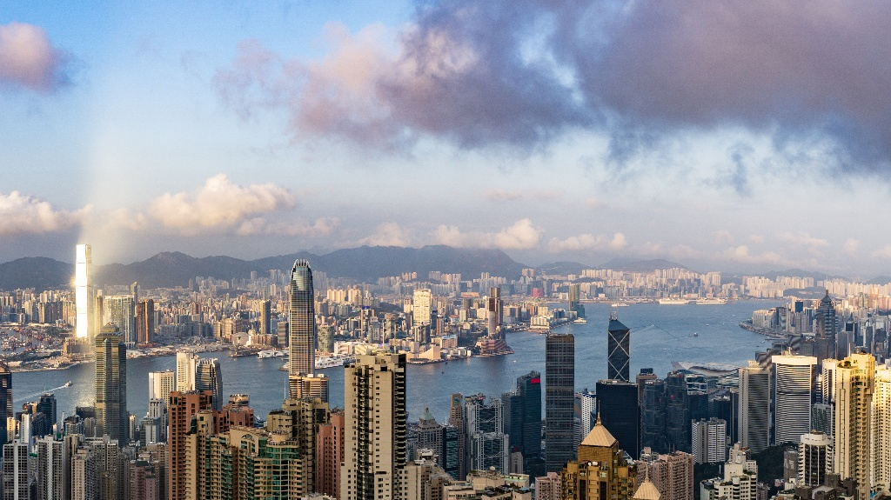
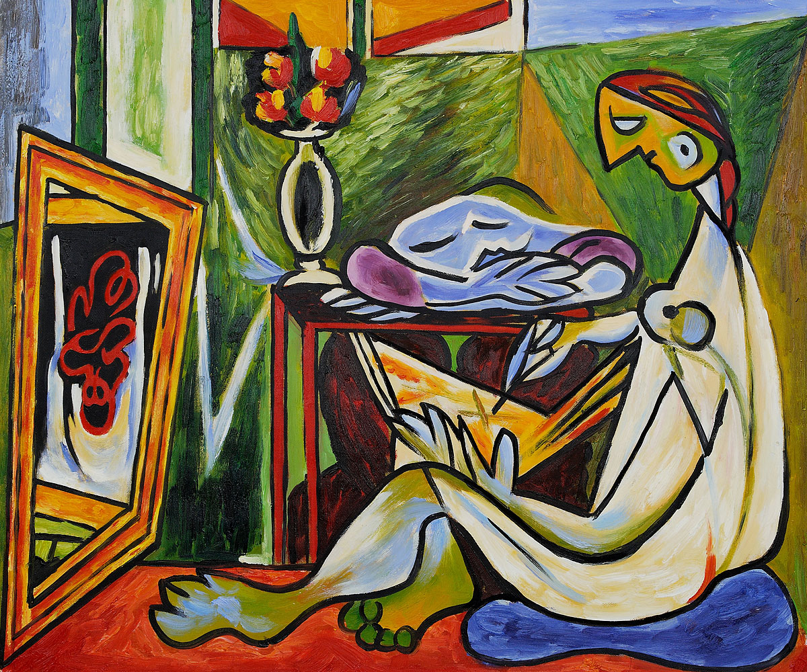

# Image_Style_Transfer

## Introduction
Trying to give an implement of the so-called arbitrary style transfer with pytorch.

## Examples

  
  

  

## Reference
1. Huang, Xun, and S. Belongie. "Arbitrary Style Transfer in Real-time with Adaptive Instance
Normalization." 2017.
